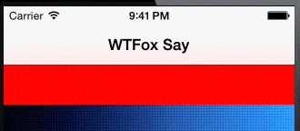
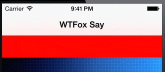
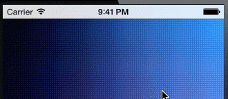
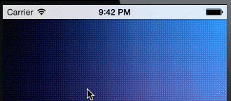

# TLYShyNavBar

This component helps you mimick the navigation bar auto scrolling that you see in the facebook, instagram and other apps. Not only that, but with the ability to add an additional extension that scrolls along as well! It is designed for **ease of use**, and is battle tested in our own [Telly app](https://itunes.apple.com/us/app/telly/id524552885?mt=8)<sup>[1]</sup>!


<sub>[1]: AppStore version doesn't have the latest, though. Coming soon. :grin:</sub><br />
<sub>[*]: Content are shown for demo purpose only of how this component is used in the Telly app. We hold the right to show those contents as part of our contract with Sony Pictures.</sub>

## Outline 

+ **[Features](#features)**: See what this component has to offer!
+ **[Quick Start](#quick-start)**: TL;DR people, you'll love this.
+ **[Design Goals](#design-goals)**: The cherished aspects of this component.
+ **[A Deeper Look](#a-deeper-look)**: You're invensted in this now and want to make the most out of it.
+ **[How it Works](#how-it-works)**: The deep stuff...
+ **[Remarks](#remarks)**: Read this before losing all hope.
+ **[Similar Projects](#similar-projects)**: Similar projects that influenced the project in some way.

## Features

+ Optional extension view to the `UINavigationBar`!



+ Auto expand if below threshold



+ Auto contract if below threshold



+ Very responsive, resilient and robust


+ Adjustable expansion resistance


+ Plays well with `pushViewController`



## Quick Start

1. Get the component
  + [CocoaPods](http://cocoapods.org)
      * Add the following to you [Podfile](http://guides.cocoapods.org/using/the-podfile.html) `pod TLYShyNavBar`

  + Download the project/git submodules, and drag the `TLYShyNavBar` folder to your project.

2. `#import "TLYShyNavBarManager.h"` 
  + I suggest adding it to your pch file, or wherever you want to use the component.
 
3. Write one line of code to get started!!

```objc
/* In your UIViewController viewDidLoad or after creating the scroll view. */
self.shyNavBarManager.scrollView = self.scrollView;
```

**IMPORTANT!!** If you are assigning a delegate to your scrollView, do that **before** assigning the scrollView to the `TLYShyNavBarManager`! To learn more, [see below](#how-it-works).

## Design Goals

+ **Ease of Use**: This is the most important, and should never be compromised. Even if compatability breaks or versatility is limited, the component should remain easy to integrate.
+ **Portable**: Less dependencies, lightweight, self-contained, ... etc.
+ **Compatability**: Whenever possible, the component should simply work with whatever you throw at it.

## A Deeper Look

The above example, while small, is complete! It makes the navigation bar enriched with humbility, that it will start getting out of the way when the scroll view starts scrolling. But, you may want to do more than that!

#### ACCESS THE MANAGER OF SHYNESS

Simply access it within your `UIViewController` subclass as a property. The property is lazy loaded for you, so you don't have to instantiate anything:

```objc
self.shyNavBarManager
```

#### ADDING AN EXTENSION VIEW

You can assign your own extension view, and it will appear right beneath the navigation bar. It will slide beneath the navigation bar, before the navigation bar starts shrinking (contracting). Adding an extension view is as simple as:

```objc
/* Also in your UIViewController subclass */
[self.shyNavBarManager setExtensionView:self.toolbar];
```

#### CONTROLLING THE RESISTANCE

When you starting scrolling up (going down the view) or scrolling down (going up the view), you may want the navigation bar to hold off for a certain amount (tolerance) before changing states. (i.e. if the user scrolls down 10 px, don't immediately start showing the contracted navigation bar, but wait till he scrolls, say, 100 px).

You can control that using the following properties on the `shyNavBarManager`:

```objc
/* Control the resistance when scrolling up/down before the navbar 
 * expands/contracts again.
 */
@property (nonatomic) CGFloat expansionResistance;      // default 200
@property (nonatomic) CGFloat contractionResistance;    // default 0
```

## How it Works

OK, I'll admit that I added this section purely to rant about how this project came together, and the desicion making process behind it.

#### THE BASICS

At a component-user level, this works by adding a category to `UIViewController` with a `TLYShyNavBarManager` property. The property is lazily loaded, to cut any unnecessary overhead, and lower the barrier of entry. From the property, you can start customizing the `TLYShyNavBarManager` for that view controller.

Now, you may start asking, what about the navigation bar? Well, the navigation bar is accessed from the view controller your using the manager in. Let's break that down...

1. When you access the `shyNavBarManager` for the first time, it is created with the `self` parameter passed to it, effectively binding the `shyNavBarManager` to the `UIViewController`.
2. The `shyNavBarManager` accesses the `UINavigationBar` through the assigned `UIViewController`.

... And that is how the basic setup is done!

#### THE EXTENSION VIEW

When you call `setExtensionView:`, it simply resizes an internal container view, and adds your extension view to it. There is no magic here, just simple, single view extension.

#### CAPTURING SCROLL VIEW EVENTS

This one was a pain... First, the experiments that this project went through included:

+ Observing the contentOffset property
+ Adding self as a `UIGestureRecognizer` target
+ Adding a `UIPanGestureRecognizer` to the scroll view.
+ Make the user implement `UIScrollViewDelegate`, and send us the events.

The above didn't yield the perfect experience we were hoping for, except the last one. It did, however, make for redundant code everywhere, and forced the component user to implement the `UIScrollViewDelegate`. Tha's when the `NSProxy` happened.

When you assign the `scrollView` property to the TLYShyNavBarManager, we attach a proxy object to the `UIScrollView` as the delegate, and then the original delegate to that proxy. The proxy forwards the events we are interested in to the `TLYShyNavBarManager`, and of course, does everything else normally for the original selector, you won't even notice a thing!

#### THE DRAWER CONCEPT

The way the offsets are applied to the navigation bar and extension view is through an elegent linked list implementation. We set the offset to the first node (navigation bar), and ...

+ If it is contracting:
  - We pass the contraction amount to the next node, and it returned a residual amount.

+ If we are expanding:
  - We process the offset in the first node, and pass the residual to the next node. 

It is a simple concept. Say we dragged down by 100 px, and the nav bar was contracted. The navigation bar would take 64 px of that to expand, and then pass the residual 36 px to the next node (extension view) to calculate its offset. The same goes for contracting, but it starts from the last node, all the way up to the navigation bar.

*Note:* Even though there might be an illusion that the views are expanding and contracting, it's really just a translation (scrolling) of the views. There might be an advantage to actually resizing the bounds, so the extension view doesn't appear behind the navigation bar, for example, so that approach might be explored in the future.

## Remarks

There are downsides in making this component as easy to use as it is. If you have read the how it works section carefully, you'd realize that trying to configure the the `shyNavBarManager` before it is included in the `UINavigationController` heirarchy, will break the component, since within the component, we cannot find the navigation bar, and an assert is triggered:

```objc
NSAssert(navbar != nil, @"You are using the component wrong... Please see the README file.");
```

Of course, that can be avoided by creating your own `TLYShyNavBarManager`, like so:

```objc
TLYShyNavBarManager *shyManager = [TLYShyNavBarManager new];
shyManager.expansionResistance = 777.f;

/* ... sometime after the view controller is added to the hierarchy  */
viewController.shyNavBarManager = shyManager;
```

## Similar Projects

+ [AMScrollingNavbar](https://github.com/andreamazz/AMScrollingNavbar)
+ [GTScrollNavigationBar](https://github.com/luugiathuy/GTScrollNavigationBar)
+ [JKAutoShrinkView](https://github.com/fsjack/JKAutoShrinkView)
+ [SherginScrollableNavigationBar](https://github.com/shergin/SherginScrollableNavigationBar)
